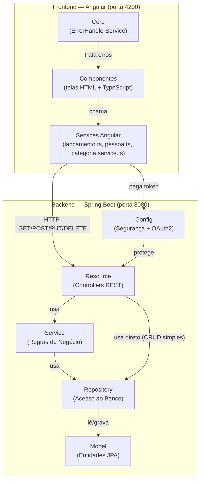
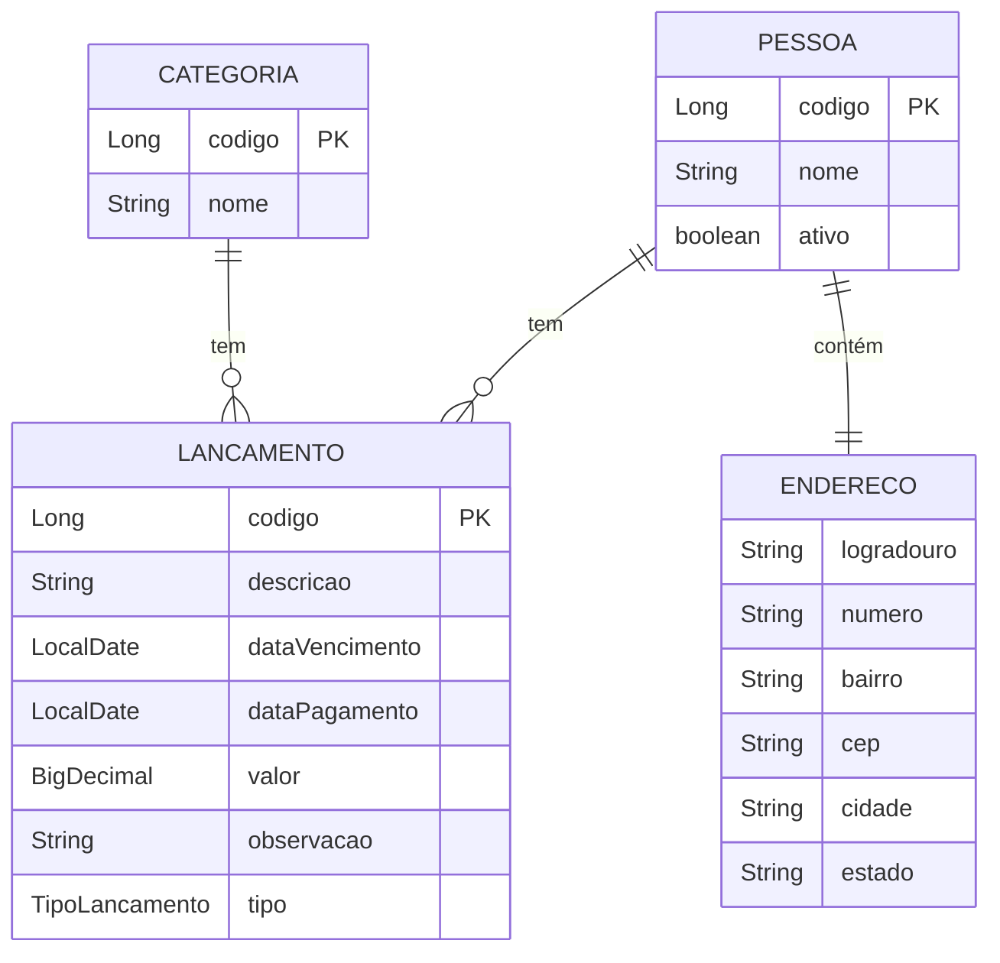
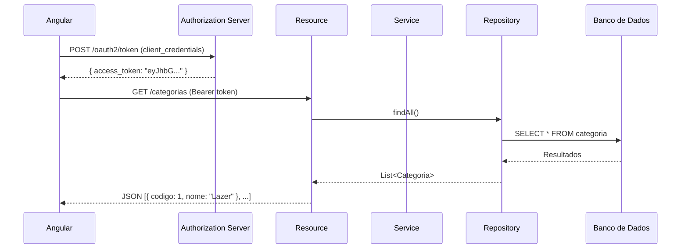
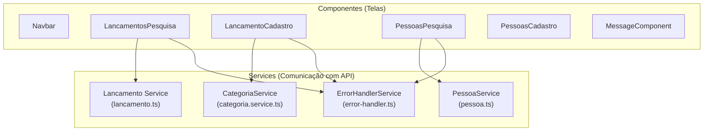
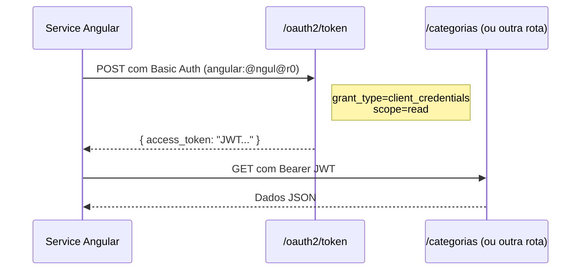

# 📖 Documentação do Projeto Algamoney

Sistema de controle financeiro pessoal com **backend em Spring Boot (Java)** e **frontend em Angular 22 com PrimeNG**.

---

## 🏗️ Visão Geral da Arquitetura



---

## ⚙️ Backend (Spring Boot)

O backend segue a arquitetura em camadas clássica do Spring. A requisição chega pela camada **Resource**, passa pelo **Service** quando há lógica de negócio, e alcança o **Repository** que conversa com o banco de dados.

---

### 📁 `model/` — As Entidades (o que existe no banco)

> **Para que serve:** Define as **tabelas do banco de dados** como classes Java. Cada classe anotada com `@Entity` vira uma tabela. Cada atributo vira uma coluna.

| Arquivo | Tabela | Descrição |
|---------|--------|-----------|
| [Categoria.java](file:///c:/Users/felip/Desktop/estudos_angular/algamoney/src/main/java/com/algamoney_api/algamoney/model/Categoria.java) | `categoria` | Possui `codigo` (chave primária auto-incrementada) e `nome` (obrigatório, 3-20 caracteres). Ex: "Alimentação", "Lazer". |
| [Pessoa.java](file:///c:/Users/felip/Desktop/estudos_angular/algamoney/src/main/java/com/algamoney_api/algamoney/model/Pessoa.java) | `pessoa` | Possui `codigo`, `nome`, `ativo` (boolean) e um `endereco` embutido. |
| [Endereco.java](file:///c:/Users/felip/Desktop/estudos_angular/algamoney/src/main/java/com/algamoney_api/algamoney/model/Endereco.java) | *(embutido em pessoa)* | Classe `@Embeddable` com logradouro, numero, complemento, bairro, cep, estado, cidade. Seus campos ficam na própria tabela `pessoa`. |
| [Lancamento.java](file:///c:/Users/felip/Desktop/estudos_angular/algamoney/src/main/java/com/algamoney_api/algamoney/model/Lancamento.java) | `lancamento` | A entidade principal. Possui `descricao`, `dataVencimento`, `dataPagamento`, `valor`, `observacao`, `tipo` (enum), e relacionamentos `@ManyToOne` com **Categoria** e **Pessoa**. |
| [TipoLancamento.java](file:///c:/Users/felip/Desktop/estudos_angular/algamoney/src/main/java/com/algamoney_api/algamoney/model/TipoLancamento.java) | *(enum)* | Enum com dois valores: `RECEITA` e `DESPESA`. |

#### Relacionamentos:


---

### 📁 `repository/` — Acesso ao Banco de Dados

> **Para que serve:** É a camada que **faz as consultas SQL** (sem você precisar escrever SQL manualmente). Cada Repository é uma interface que estende `JpaRepository`, e o Spring gera automaticamente os métodos `findAll()`, `findById()`, `save()`, `deleteById()`, etc.

| Arquivo | Descrição |
|---------|-----------|
| [CategoriaRepository.java](file:///c:/Users/felip/Desktop/estudos_angular/algamoney/src/main/java/com/algamoney_api/algamoney/repository/CategoriaRepository.java) | CRUD básico de Categoria. Estende `JpaRepository<Categoria, Long>`, o que automaticamente fornece `findAll()`, `save()`, `findById()`, `deleteById()`. |
| [PessoaRepository.java](file:///c:/Users/felip/Desktop/estudos_angular/algamoney/src/main/java/com/algamoney_api/algamoney/repository/PessoaRepository.java) | CRUD de Pessoa + método customizado `findByNomeContaining(nome, pageable)` que busca pessoas cujo nome contém o texto informado, com paginação. |
| [LancamentoRepository.java](file:///c:/Users/felip/Desktop/estudos_angular/algamoney/src/main/java/com/algamoney_api/algamoney/repository/LancamentoRepository.java) | CRUD de Lançamento + estende `LancamentoRepositoryQuery` para queries customizadas. |

#### Subpasta `repository/lancamento/` — Query customizada com Criteria API

| Arquivo | Descrição |
|---------|-----------|
| [LancamentoRepositoryQuery.java](file:///c:/Users/felip/Desktop/estudos_angular/algamoney/src/main/java/com/algamoney_api/algamoney/repository/lancamento/LancamentoRepositoryQuery.java) | Interface que declara o método `filtrar(LancamentoFilter, Pageable)`. |
| [LancamentoRepositoryImpl.java](file:///c:/Users/felip/Desktop/estudos_angular/algamoney/src/main/java/com/algamoney_api/algamoney/repository/lancamento/LancamentoRepositoryImpl.java) | Implementação da query usando **Criteria API** do JPA. Monta filtros dinamicamente por descrição, data de vencimento inicial e final. Também implementa paginação manual e contagem total de registros. |

#### Subpasta `repository/filter/`

| Arquivo | Descrição |
|---------|-----------|
| [LancamentoFilter.java](file:///c:/Users/felip/Desktop/estudos_angular/algamoney/src/main/java/com/algamoney_api/algamoney/repository/filter/LancamentoFilter.java) | Classe "DTO de filtro" com os campos `descricao`, `dataVencimentoDe` e `dataVencimentoAte`. Usada para receber os parâmetros de pesquisa da URL e passá-los para a Criteria API. |

---

### 📁 `service/` — Regras de Negócio

> **Para que serve:** Contém a **lógica de negócio** da aplicação. Fica entre o Resource (que recebe a requisição) e o Repository (que acessa o banco). Só existe quando há alguma regra além de simplesmente salvar/listar.

| Arquivo | Descrição |
|---------|-----------|
| [PessoaService.java](file:///c:/Users/felip/Desktop/estudos_angular/algamoney/src/main/java/com/algamoney_api/algamoney/service/PessoaService.java) | `atualizar()` — busca a pessoa pelo código, copia as propriedades novas (exceto o código) e salva. `atualizarPropiedadeAtiva()` — ativa/inativa uma pessoa. `buscarPessoaPeloCodigo()` — busca ou lança exceção se não existir. |
| [LancamentoService.java](file:///c:/Users/felip/Desktop/estudos_angular/algamoney/src/main/java/com/algamoney_api/algamoney/service/LancamentoService.java) | `salvar()` — antes de salvar, **valida se a pessoa existe e está ativa**. Se não estiver, lança `PessoaInexistenteOuInativaException`. |

#### Subpasta `service/exception/`

| Arquivo | Descrição |
|---------|-----------|
| [PessoaInexistenteOuInativaException.java](file:///c:/Users/felip/Desktop/estudos_angular/algamoney/src/main/java/com/algamoney_api/algamoney/service/exception/PessoaInexistenteOuInativaException.java) | Exceção customizada lançada quando se tenta criar um lançamento para uma pessoa que não existe ou está inativa. |

> [!TIP]
> **Por que não existe `CategoriaService`?** Porque a categoria só tem operações simples de CRUD (listar, criar, buscar, deletar) sem nenhuma regra de negócio extra. Então o `CategoriaResource` acessa o `CategoriaRepository` diretamente.

---

### 📁 `resource/` — Os Controllers REST (Endpoints da API)

> **Para que serve:** É a **porta de entrada** da API. Recebe as requisições HTTP (GET, POST, PUT, DELETE), chama o Service ou Repository, e retorna a resposta em JSON. No Spring, o equivalente a "Controller" é o "Resource" neste projeto.

| Arquivo | Rota Base | Endpoints |
|---------|-----------|-----------|
| [CategoriaResource.java](file:///c:/Users/felip/Desktop/estudos_angular/algamoney/src/main/java/com/algamoney_api/algamoney/resource/CategoriaResource.java) | `/categorias` | `GET /` — lista todas, `POST /` — cria, `GET /{codigo}` — busca por código, `DELETE /{codigo}` — remove |
| [PessoaResource.java](file:///c:/Users/felip/Desktop/estudos_angular/algamoney/src/main/java/com/algamoney_api/algamoney/resource/PessoaResource.java) | `/pessoa` | `GET /` — pesquisa paginada por nome, `POST /` — cria, `GET /{codigo}` — busca, `DELETE /{codigo}` — remove, `PUT /{codigo}` — atualiza, `PUT /{codigo}/ativo` — ativa/inativa |
| [LancamentoResource.java](file:///c:/Users/felip/Desktop/estudos_angular/algamoney/src/main/java/com/algamoney_api/algamoney/resource/LancamentoResource.java) | `/lancamentos` | `GET /` — pesquisa com filtros + paginação, `GET /{codigo}` — busca, `POST /` — cria (valida pessoa ativa), `DELETE /{codigo}` — remove |

---

### 📁 `config/` — Segurança e OAuth2

> **Para que serve:** Configura toda a parte de **autenticação e autorização** da API usando Spring Security + OAuth2.

| Arquivo | Descrição |
|---------|-----------|
| [SecurityConfig.java](file:///c:/Users/felip/Desktop/estudos_angular/algamoney/src/main/java/com/algamoney_api/algamoney/config/SecurityConfig.java) | **Resource Server** — Define que todas as rotas `/categorias/**`, `/lancamentos/**`, `/pessoas/**` exigem autenticação via token JWT. Também define o encoder de senhas (BCrypt) e um usuário em memória (`admin/admin`). |
| [AuthorizationServerConfig.java](file:///c:/Users/felip/Desktop/estudos_angular/algamoney/src/main/java/com/algamoney_api/algamoney/config/AuthorizationServerConfig.java) | **Authorization Server** — Emite tokens JWT. Registra o client `angular` (senha `@ngul@r0`) com suporte a `client_credentials` e `password` grant. Gera chaves RSA para assinar os tokens. Endpoint: `POST /oauth2/token`. |

---

### 📁 `cors/` — Configuração de CORS

| Arquivo | Descrição |
|---------|-----------|
| [CorsFilter.java](file:///c:/Users/felip/Desktop/estudos_angular/algamoney/src/main/java/com/algamoney_api/algamoney/cors/CorsFilter.java) | Filtro que permite requisições vindas de `http://localhost:4200` (o Angular). Sem isso, o navegador bloquearia todas as chamadas do frontend para o backend por política de segurança (CORS). |

---

### 📁 `event/` — Eventos do Spring

> **Para que serve:** Implementa o padrão **Observer** do Spring para reutilizar lógica comum. Quando um recurso é criado (categoria, pessoa, etc.), um evento é disparado e o listener adiciona o header `Location` na resposta HTTP (padrão REST para recursos criados).

| Arquivo | Descrição |
|---------|-----------|
| [RecursoCriadoEvent.java](file:///c:/Users/felip/Desktop/estudos_angular/algamoney/src/main/java/com/algamoney_api/algamoney/event/RecursoCriadoEvent.java) | Evento que carrega o `response` HTTP e o `codigo` do recurso recém-criado. |
| [RecursoCriadoListener.java](file:///c:/Users/felip/Desktop/estudos_angular/algamoney/src/main/java/com/algamoney_api/algamoney/event/listener/RecursoCriadoListener.java) | Listener que escuta o evento e adiciona o header `Location` com a URI do novo recurso (ex: `/categorias/5`). |

---

### 📁 `exceptionhandler/` — Tratamento Global de Erros

| Arquivo | Descrição |
|---------|-----------|
| [AlgamoneyExceptionHandler.java](file:///c:/Users/felip/Desktop/estudos_angular/algamoney/src/main/java/com/algamoney_api/algamoney/exceptionhandler/AlgamoneyExceptionHandler.java) | Classe `@RestControllerAdvice` que captura exceções globalmente e retorna respostas padronizadas com `mensagemUsuario` e `mensagemDesenvolvedor`. Trata: JSON inválido, campos obrigatórios faltando, violações de integridade no banco, e registros não encontrados. |

---

## 🖥️ Fluxo Completo de uma Requisição (Backend)



---

## 🌐 Frontend (Angular 22 + PrimeNG)

### Arquitetura do Frontend



---

### 📁 Componentes (Telas)

Cada componente Angular é formado por 3 arquivos: `.ts` (lógica), `.html` (template), `.css` (estilos).

| Componente | Pasta | Descrição |
|-----------|-------|-----------|
| **App** | [app.ts](file:///c:/Users/felip/Desktop/estudos_angular/algamoney-ui/src/app/app.ts) | Componente raiz. Importa todos os outros componentes e renderiza conforme o [app.html](file:///c:/Users/felip/Desktop/estudos_angular/algamoney-ui/src/app/app.html). |
| **Navbar** | [navbar/](file:///c:/Users/felip/Desktop/estudos_angular/algamoney-ui/src/app/navbar) | Barra de navegação superior. |
| **LancamentosPesquisa** | [lancamentos-pesquisa/](file:///c:/Users/felip/Desktop/estudos_angular/algamoney-ui/src/app/lancamentos-pesquisa) | Tela de pesquisa de lançamentos com filtros (descrição, data vencimento) e tabela paginada. |
| **LancamentoCadastro** | [lancamento-cadastro/](file:///c:/Users/felip/Desktop/estudos_angular/algamoney-ui/src/app/lancamento-cadastro) | Formulário de cadastro de lançamentos. Carrega categorias da API via `CategoriaService` no `ngOnInit()`. |
| **PessoasPesquisa** | [pessoas-pesquisa/](file:///c:/Users/felip/Desktop/estudos_angular/algamoney-ui/src/app/pessoas-pesquisa) | Tela de pesquisa de pessoas com filtro por nome, tabela paginada, e ações de excluir e ativar/inativar. |
| **PessoasCadastro** | [pessoas-cadastro/](file:///c:/Users/felip/Desktop/estudos_angular/algamoney-ui/src/app/pessoas-cadastro) | Formulário de cadastro de pessoas. |
| **MessageComponent** | [message/](file:///c:/Users/felip/Desktop/estudos_angular/algamoney-ui/src/app/message) | Componente reutilizável de validação que exibe mensagens de erro do PrimeNG quando um campo de formulário está inválido e foi tocado pelo usuário. |

---

### 📁 Services Angular (Comunicação com a API)

> **Para que serve:** Os services no Angular são o equivalente ao "Repository" do backend, mas do lado do frontend. Eles **fazem as chamadas HTTP** para a API REST. Cada service primeiro obtém um token OAuth2 e depois usa esse token para fazer a requisição autenticada.

| Arquivo | Descrição |
|---------|-----------|
| [lancamento.ts](file:///c:/Users/felip/Desktop/estudos_angular/algamoney-ui/src/app/lancamento.ts) | `pesquisar(filtro)` — busca lançamentos com filtros e paginação. `excluir(codigo)` — deleta um lançamento. Contém também a classe `LancamentoFiltro`. |
| [pessoa.ts](file:///c:/Users/felip/Desktop/estudos_angular/algamoney-ui/src/app/pessoa.ts) | `pesquisar(filtro)` — busca pessoas por nome com paginação. `excluir(codigo)` — deleta. `mudarStatus(codigo, ativo)` — ativa/inativa pessoa. Contém a classe `PessoaFiltro`. |
| [categoria.service.ts](file:///c:/Users/felip/Desktop/estudos_angular/algamoney-ui/src/app/categoria.service.ts) | `listarTodas()` — busca todas as categorias (sem paginação). |

> [!NOTE]
> **Por que uns têm `.service.ts` e outros não?** É apenas uma questão de convenção de nomenclatura. O padrão do Angular recomenda usar `.service.ts`, mas os arquivos `lancamento.ts` e `pessoa.ts` foram nomeados sem o sufixo `.service`. **Funcionalmente não há diferença alguma** — todos são services Angular com `@Injectable`.

---

### 📁 Core (Serviços Compartilhados)

| Arquivo | Descrição |
|---------|-----------|
| [error-handler.ts](file:///c:/Users/felip/Desktop/estudos_angular/algamoney-ui/src/app/core/error-handler.ts) | Serviço centralizado de tratamento de erros. Analisa o tipo do erro (string, HttpErrorResponse 4xx, ou outros) e exibe um toast de erro usando o `MessageService` do PrimeNG. |

---

### 📁 Configuração do Angular

| Arquivo | Descrição |
|---------|-----------|
| [app.config.ts](file:///c:/Users/felip/Desktop/estudos_angular/algamoney-ui/src/app/app.config.ts) | Configura: roteamento, animações, tema PrimeNG (preset Aura com cor primária customizada), tradução do calendário para português, locale `pt-BR`, e providers globais (`MessageService`, `ConfirmationService`). |
| [app.routes.ts](file:///c:/Users/felip/Desktop/estudos_angular/algamoney-ui/src/app/app.routes.ts) | Define as rotas da aplicação (atualmente vazio/mínimo, pois a navegação é feita por comentar/descomentar componentes no `app.html`). |

---

## 🔄 Fluxo de Autenticação (OAuth2)

Toda chamada do frontend para a API segue este padrão:



> [!IMPORTANT]
> Atualmente cada chamada HTTP gera um **novo token**. Em produção, o ideal seria cachear o token e reutilizá-lo até expirar (30 minutos conforme configurado no `AuthorizationServerConfig`).

---

## 📂 Estrutura de Pastas Completa

```
estudos_angular/
├── algamoney/                          ← BACKEND (Spring Boot)
│   └── src/main/java/.../algamoney/
│       ├── AlgamoneyApplication.java   ← Classe main (inicia o Spring Boot)
│       ├── config/
│       │   ├── AuthorizationServerConfig.java  ← Servidor OAuth2 (emite tokens)
│       │   └── SecurityConfig.java             ← Resource Server (protege rotas)
│       ├── cors/
│       │   └── CorsFilter.java         ← Permite requisições do Angular (CORS)
│       ├── event/
│       │   ├── RecursoCriadoEvent.java  ← Evento "recurso criado"
│       │   └── listener/
│       │       └── RecursoCriadoListener.java  ← Adiciona header Location
│       ├── exceptionhandler/
│       │   └── AlgamoneyExceptionHandler.java  ← Tratamento global de erros
│       ├── model/
│       │   ├── Categoria.java          ← Entidade categoria
│       │   ├── Pessoa.java             ← Entidade pessoa
│       │   ├── Endereco.java           ← Endereço embutido
│       │   ├── Lancamento.java         ← Entidade lançamento
│       │   └── TipoLancamento.java     ← Enum RECEITA/DESPESA
│       ├── repository/
│       │   ├── CategoriaRepository.java
│       │   ├── PessoaRepository.java
│       │   ├── LancamentoRepository.java
│       │   ├── filter/
│       │   │   └── LancamentoFilter.java       ← DTO de filtro
│       │   └── lancamento/
│       │       ├── LancamentoRepositoryQuery.java    ← Interface query custom
│       │       └── LancamentoRepositoryImpl.java     ← Implementação Criteria API
│       ├── resource/
│       │   ├── CategoriaResource.java  ← REST /categorias
│       │   ├── PessoaResource.java     ← REST /pessoa
│       │   └── LancamentoResource.java ← REST /lancamentos
│       └── service/
│           ├── LancamentoService.java  ← Valida pessoa antes de salvar
│           ├── PessoaService.java      ← Atualiza pessoa e status
│           └── exception/
│               └── PessoaInexistenteOuInativaException.java
│
└── algamoney-ui/                       ← FRONTEND (Angular 22)
    └── src/app/
        ├── app.ts                      ← Componente raiz
        ├── app.html                    ← Template raiz (monta a tela)
        ├── app.config.ts               ← Configuração Angular + PrimeNG
        ├── app.routes.ts               ← Rotas (mínimo por enquanto)
        ├── lancamento.ts               ← Service de lançamentos
        ├── pessoa.ts                   ← Service de pessoas
        ├── categoria.service.ts        ← Service de categorias
        ├── core/
        │   └── error-handler.ts        ← Tratamento centralizado de erros
        ├── navbar/                     ← Barra de navegação
        ├── lancamentos-pesquisa/       ← Tela pesquisa de lançamentos
        ├── lancamento-cadastro/        ← Tela cadastro de lançamento
        ├── pessoas-pesquisa/           ← Tela pesquisa de pessoas
        ├── pessoas-cadastro/           ← Tela cadastro de pessoa
        └── message/                    ← Componente de validação reutilizável
```
